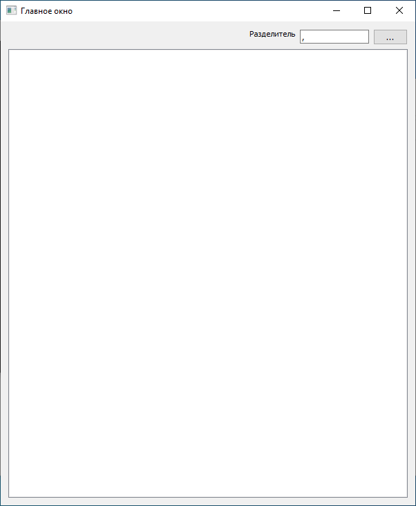
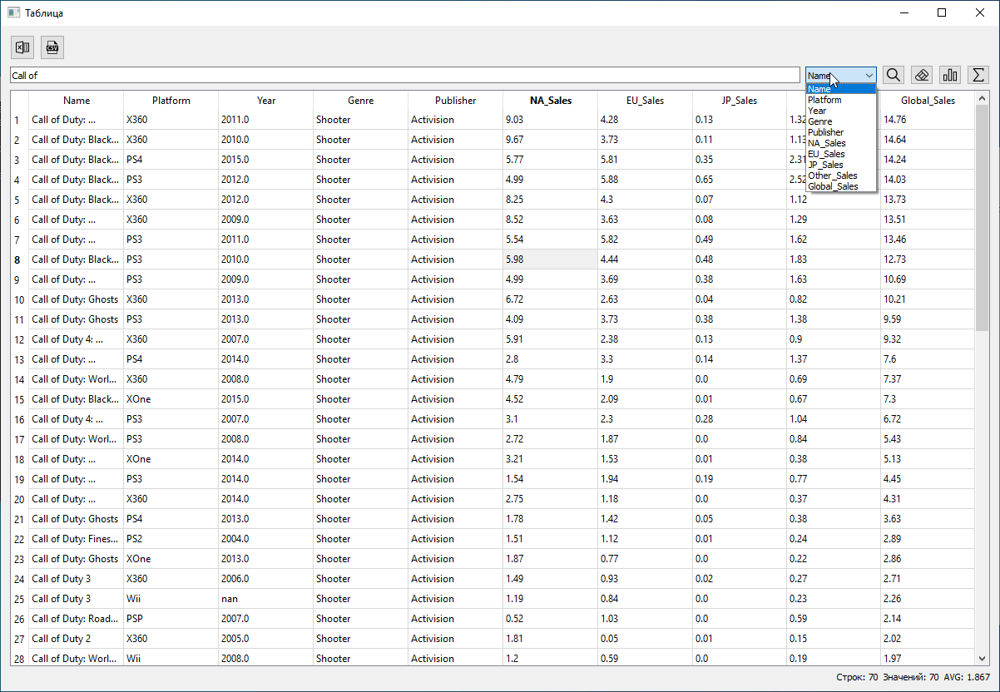
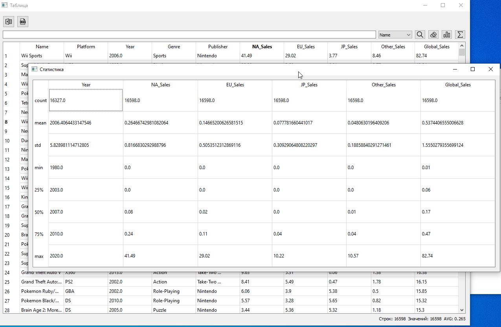
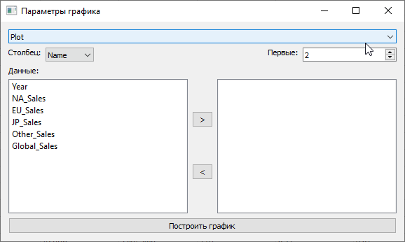

# О проекте
Проект создан для закрепления полученных теоретических знаний в областях программирования на языке Python, анализа данных и методов машинного обучения.

Функции, которые должна обеспечивать программа:
* Работа с любыми CSV-файлами (открыть, экспортировать)
* Сортировка данных
* Поиск по полям массива данных
* Статистика по данным из файла
* Инструменты для построения различных диаграмм (круговая диаграмма, график, "ящик с усами", гистограмма)
* Предсказание данных с помощью регрессии

# Требования
Для работы проекта требуется установка следующих библиотек:
- pandas
- PyQt5
- matplotlib

Для установки необходимо ввести:

    pip install имя_библиотеки

# Скриншоты

    
    
    

    
    

